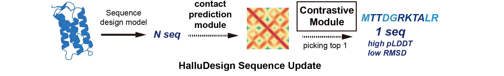

# CoDP (Contrastive-learning-based Distogram Prediction Model)


Integrated with HalluDesign, the CoDP model serves as a fast, distogram-based ranking tool. It leverages contrastive learning to quickly screen sequences by their predicted structural compatibility, facilitating a more efficient design cycle. This capability directly enhances the stability of monomeric proteins and improves the specificity of protein-ligand interactions.

we also directly implementing modified LigandMPNN in our code.

# Installation
if your already installied HalluDesign, you no need to install in this way.
```
mamba create -n CoDP python==3.11

# for Ligandmpnn
cd LigandMPNN 
pip3 install -r requirements.txt
bash get_model_params.sh "./model_params"
```
# Inference
```
python /CoDP_MPNN.py --input_file .pdb --output_dir ./test --mpnn ligand_mpnn --esmhead
```
# Training
all code are under 
the dataset we used for training are not able to realase now. But we release our training code.
```
python train_contact.py
python train_contractive.py
```
# Reference
```
@article{dauparas2023atomic,
  title={Atomic context-conditioned protein sequence design using LigandMPNN},
  author={Dauparas, Justas and Lee, Gyu Rie and Pecoraro, Robert and An, Linna and Anishchenko, Ivan and Glasscock, Cameron and Baker, David},
  journal={Biorxiv},
  pages={2023--12},
  year={2023},
  publisher={Cold Spring Harbor Laboratory}
}
@article{dauparas2022robust,
  title={Robust deep learning--based protein sequence design using ProteinMPNN},
  author={Dauparas, Justas and Anishchenko, Ivan and Bennett, Nathaniel and Bai, Hua and Ragotte, Robert J and Milles, Lukas F and Wicky, Basile IM and Courbet, Alexis and de Haas, Rob J and Bethel, Neville and others},
  journal={Science},
  volume={378},
  number={6615},  
  pages={49--56},
  year={2022},
  publisher={American Association for the Advancement of Science}
}
```
# License
The CoDP project, including both the source code and model weights, is licensed under the [MIT License](LICENSE)
LigandMPNN project (https://github.com/dauparas/LigandMPNN), is licensed under the [MIT License](LICENSE)